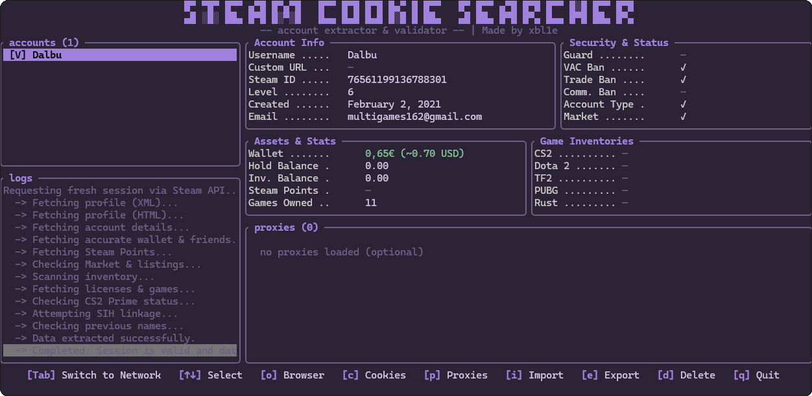
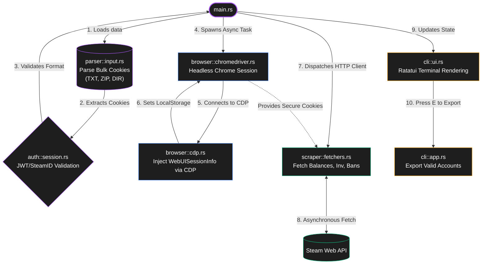

##  Steam Cookie Searcher

<p align="left">
  <a href="https://app.codacy.com/gh/xbl1e/steam-cookie-searcher/dashboard?utm_source=gh&utm_medium=referral&utm_content=&utm_campaign=Badge_grade"></a>
  <a href="https://github.com/xbl1e/steam-cookie-searcher/releases"></a>
  <a href="https://www.rust-lang.org/"></a>
  <a href="https://github.com/xbl1e/steam-cookie-searcher/actions"></a>
  <a href="https://opensource.org/licenses/MIT"></a>
</p>

A terminal application written in Rust to verify and extract Steam cookies. It uses [Ratatui](https://ratatui.rs/) for the user interface and [Thirtyfour](https://github.com/jonhoo/thirtyfour) to interact with a headless Chrome browser.

<p align="center">
  
</p>

### &nbsp;&nbsp;Why?

Recent updates to Steam's authentication system deprecated traditional cookie-based logins on several endpoints. Steam migrated to React-based components that rely on `WebUISessionInfo` stored in `localStorage`. This caused widespread session-handling failures across the ecosystem.

Many popular libraries and tools encountered this problem, with developers actively searching for a solution:

- [x] [Cannot get steamLoginSecure cookie via refresh token (AccessDenied) #56](https://github.com/DoctorMcKay/node-steam-session/issues/56)
- [ ] [ISteamUser::GetAuthTicketForWebApi #453](https://github.com/DoctorMcKay/node-steam-user/issues/453)
- [x] [Added email login support #131](https://github.com/bukson/steampy/issues/131)

This project solves the issue by deploying a headless browser to inject the required `localStorage` tokens across all necessary domains, successfully restoring session persistence.

---

### &nbsp;&nbsp;Features

| Feature | Description |
| :--- | :--- |
| **Bulk Parsing** | Reads cookies directly from `.txt`, `.zip` archives, and nested directory trees. |
| **Session Injection** | Leverages a headless `chromedriver` to bypass token patches via `localStorage`. |
| **Account Scraping** | Safely fetches wallet balance, inventories (CS2, TF2, Rust), and VAC statuses. |
| **Proxy Routing** | Built-in support for HTTP/SOCKS proxies to distribute network load. |
| **TUI Inspector** | Terminal interface featuring a live network inspector and request logging. |

---

### &nbsp;&nbsp;Structure



```text
src/
├── main.rs                 # Entry point and concurrency management
├── auth/
│   ├── jwt.rs              # JSON Web Token decoding
│   ├── mod.rs              # Module definition
│   └── session.rs          # Session validation logic
├── browser/
│   ├── cdp.rs              # Chrome DevTools Protocol commands
│   ├── chromedriver.rs     # Headless instance spawner
│   └── mod.rs              # Module definition
├── cli/
│   ├── app.rs              # Application state and event loop
│   ├── mod.rs              # Module definition
│   ├── tui.rs              # Terminal setup and teardown
│   └── ui.rs               # Ratatui rendering logic
├── models/
│   ├── account.rs          # Steam account struct
│   ├── cookie.rs           # Cookie parsing structures
│   ├── mod.rs              # Module definition
│   ├── network.rs          # Network request interception logs
│   └── proxy.rs            # Proxy configuration struct
├── net/
│   ├── client.rs           # Reqwest client configuration
│   └── mod.rs              # Module definition
├── parser/
│   ├── input.rs            # ZIP and TXT extraction logic
│   └── mod.rs              # Module definition
├── scraper/
│   ├── fetchers.rs         # Steam Web API endpoint calls
│   ├── mod.rs              # Module definition
│   └── orchestrator.rs     # Async task management
└── utils/
    ├── ip.rs               # Proxy IP and Geo-location validation
    ├── mod.rs              # Module definition
    ├── regex.rs            # Text parsing patterns
    ├── time.rs             # Unix timestamp conversions
    └── xml.rs              # XML/HTML response parsers
```

---

### &nbsp;&nbsp;Usage

> [!TIP]  
> The application will **automatically download** the correct `chromedriver` binary for your OS (Windows/macOS/Linux) on the first run. You only need to have the regular Google Chrome browser installed on your system.

**Option 1: Download Pre-compiled Binary (Recommended)**  
Grab the latest executable for your Operating System from the [Releases](https://github.com/xbl1e/steam-cookie-searcher/releases) tab and run it directly. No installation required.

**Option 2: Build from Source**  
If you prefer to compile the application yourself, ensure you have [Rust](https://www.rust-lang.org/tools/install) installed:

```bash
cargo build --release    # Compile the production binary
cargo run                # Run the application
```

---

### &nbsp;&nbsp;Keybindings
Interact with the TUI using the following controls:

- <kbd>1</kbd> <kbd>2</kbd> <kbd>3</kbd> : Toggle between input modes *(Clipboard, Paste, Local)*.
- <kbd>Tab</kbd> : Switch between the `Data` panel and the `Network` inspector.
- <kbd>Enter</kbd> : View detailed breakdown of a selected row.
- <kbd>E</kbd> : Export valid sessions to disk.
- <kbd>Esc</kbd> : Go back or exit.

---

### &nbsp;&nbsp;Roadmap

- [ ] Add persistent login integration across all external Steam web URLs.
- [ ] Inject session/login directly into the local Steam Client Launcher.
- [ ] Expand API endpoints for deeper account metric scraping.
- [ ] Support headless Firefox alongside ChromeDriver.

---

### &nbsp;&nbsp;Credits

This project was heavily inspired by the authentication struggles documented by the community across various Open Source libraries. A special thanks to the maintainers and contributors of these repositories for paving the way and providing context around Steam's `WebUISessionInfo` migration:

- [DoctorMcKay / node-steam-session](https://github.com/DoctorMcKay/node-steam-session)
- [DoctorMcKay / node-steam-user](https://github.com/DoctorMcKay/node-steam-user)
- [bukson / steampy](https://github.com/bukson/steampy)
- [Philipp15b / go-steam](https://github.com/Philipp15b/go-steam)
